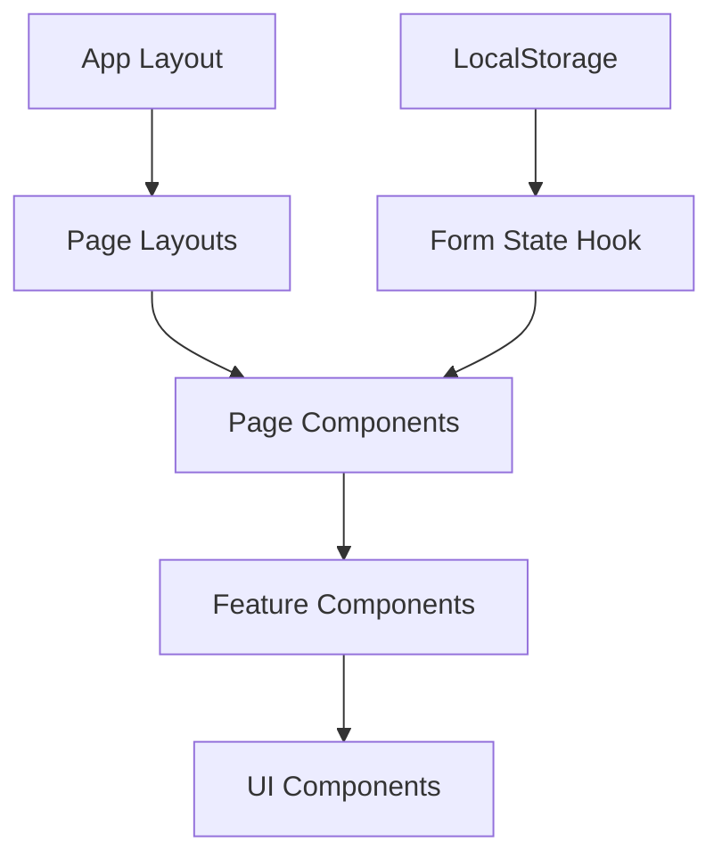

# System Patterns: WordJet

## Application Architecture

WordJet follows a modern Next.js application architecture with the following key components:

1. **App Router**: Utilizes Next.js 15's app router for routing and page organization
   - `/app` - Main application directory
   - Route-based folder structure with page.tsx files
   - Client and server components are appropriately segregated

2. **Component Structure**:
   - UI components (based on shadcn/ui library)
   - Feature-specific components
   - Layout components
   - Page components

3. **Data Flow**:
   - Form state management using custom hooks
   - Local storage for persisting form data between steps
   - Future API integration points defined but not yet implemented

## Key Design Patterns

1. **Multi-step Wizard Pattern**:
   - The content creation flow follows a step-by-step wizard pattern
   - Each step is encapsulated in its own route
   - Form state is persisted between steps
   - Navigation between steps is controlled for data integrity

2. **Composition Pattern**:
   - Components are composed from smaller, reusable UI components
   - Layout components wrap page content
   - Form sections are composed of input components

3. **Container/Presentation Pattern**:
   - Clear separation between container components (with logic) and presentation components
   - UI components are primarily presentational
   - Logic is handled in page components or custom hooks

4. **State Management**:
   - Custom hooks for form state management
   - Local component state for UI interactions
   - LocalStorage for persistence

## Component Relationships

## Key Technical Decisions

1. **Next.js Framework**:
   - Provides server-side rendering capabilities
   - Modern app router for improved page organization
   - Built-in API routes for future backend integration

2. **TypeScript**:
   - Strong typing for component props and state
   - Interface definitions for data structures
   - Type safety across the application

3. **UI Component Library**:
   - Shadcn/ui as the foundation for UI components
   - Tailwind CSS for styling
   - Consistent design language across the application

4. **Form Management**:
   - Custom hook implementation instead of form libraries
   - Step-by-step validation
   - Persistent storage between steps

5. **Responsive Design**:
   - Mobile-first approach
   - Flexible layouts using Tailwind's grid and flex utilities
   - Responsive UI components

## Future Architecture Considerations

1. **Authentication System**:
   - User registration and login
   - Role-based access control
   - Session management

2. **Backend Integration**:
   - API routes for data persistence
   - Integration with AI services
   - User data management

3. **Real-time Collaboration**:
   - WebSocket connections for collaborative editing
   - Presence indicators
   - Change tracking

4. **Content Management**:
   - Version history
   - Archiving and recovery
   - Export to various formats 